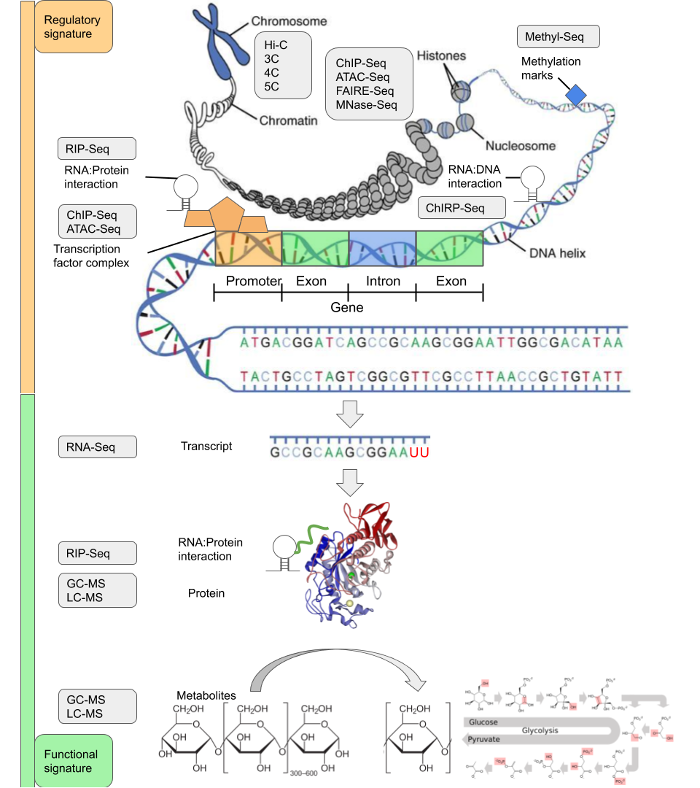

PhD student in computational biology in the [Bioinformatics Lab at Monash University](https://bioinformaticslab.erc.monash.edu/).

I am working on harmonising data from multiple modalities to build regulatory and functional signatures of a biological process. [This review contains some background information](https://doi.org/10.1093/gigascience/giaa064) for this project.

<a class="twitter-timeline" data-width="800" data-height="640" href="https://twitter.com/_tyronechen?ref_src=twsrc%5Etfw">Tweets by _tyronechen</a> 
