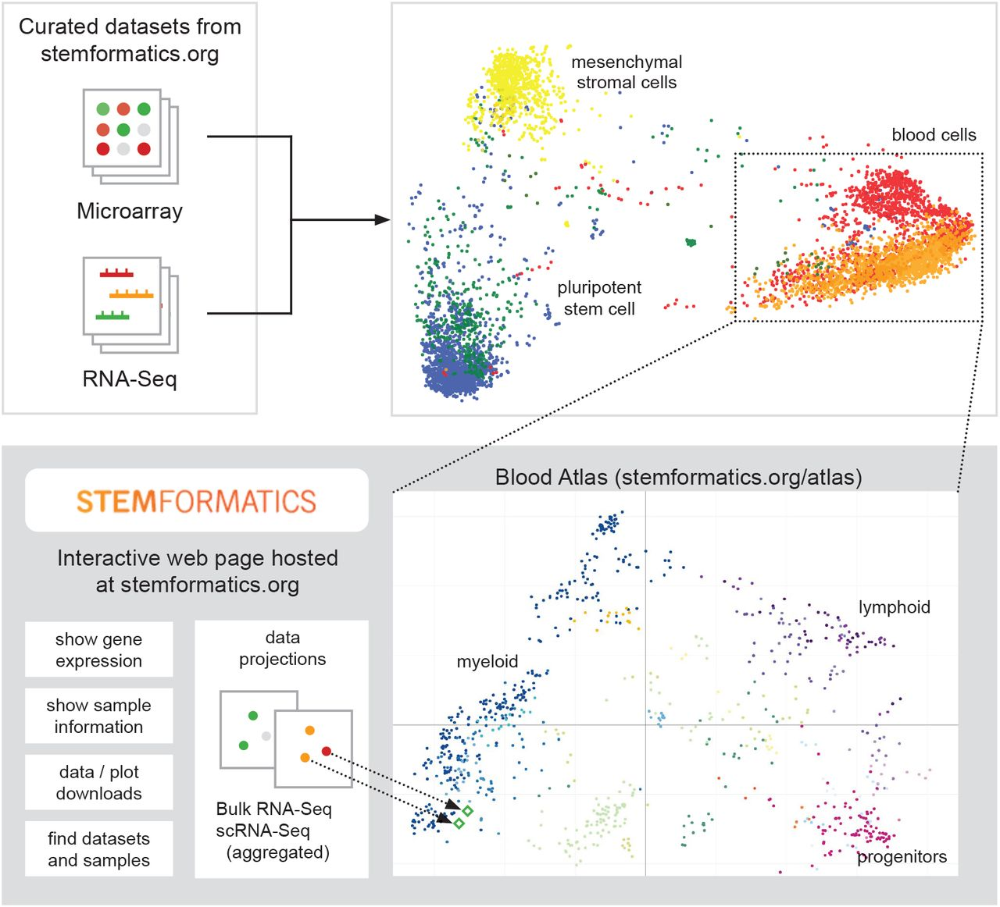

We demonstrate that it is possible to combine a large number of different profiling experiments summarised from dozens of laboratories and representing hundreds of donors, to create an integrated molecular map of human tissue.



[Online version](https://doi.org/10.1101/2020.03.09.984468)

[Download paper here](http://tyronechen.github.io/files/2020.03.09.984468v1.full.pdf)

Plain text citation:

Paul W Angel, Nadia Rajab, Yidi Deng, Chris M Pacheco, Tyrone Chen, Kim-Anh Lê Cao, Jarny Choi, Christine A Wells, &quot;A simple, scalable approach to building a cross-platform transcriptome atlas.&quot; <i>bioRxiv</i>, 2020.03.09.984468. DOI: https://doi.org/10.1101/2020.03.09.984468

Bibtex citation:
```
@article {Angel2020.03.09.984468,
	author = {Angel, Paul W and Rajab, Nadia and Deng, Yidi and Pacheco, Chris M and Chen, Tyrone and L{\^e} Cao, Kim-Anh and Choi, Jarny and Wells, Christine A},
	title = {A simple, scalable approach to building a cross-platform transcriptome atlas},
	elocation-id = {2020.03.09.984468},
	year = {2020},
	doi = {10.1101/2020.03.09.984468},
	publisher = {Cold Spring Harbor Laboratory},
	URL = {https://www.biorxiv.org/content/early/2020/03/11/2020.03.09.984468},
	eprint = {https://www.biorxiv.org/content/early/2020/03/11/2020.03.09.984468.full.pdf},
	journal = {bioRxiv}
}
```
